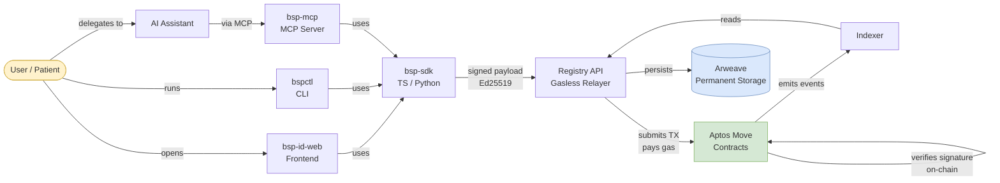
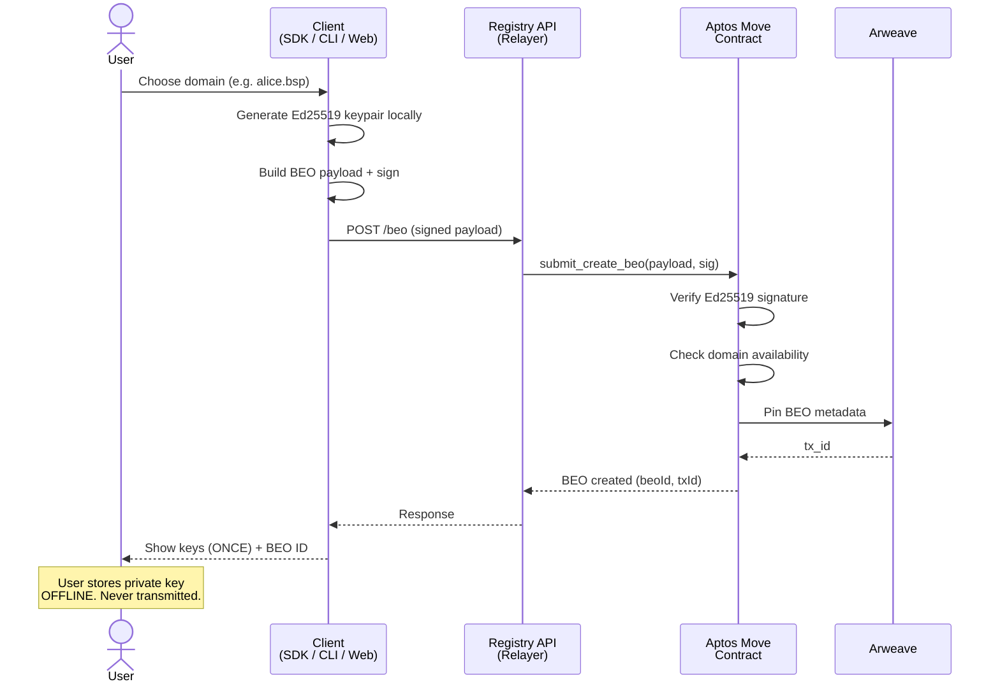
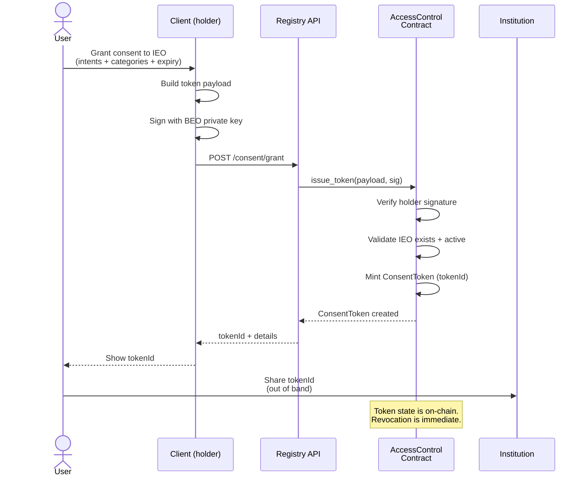
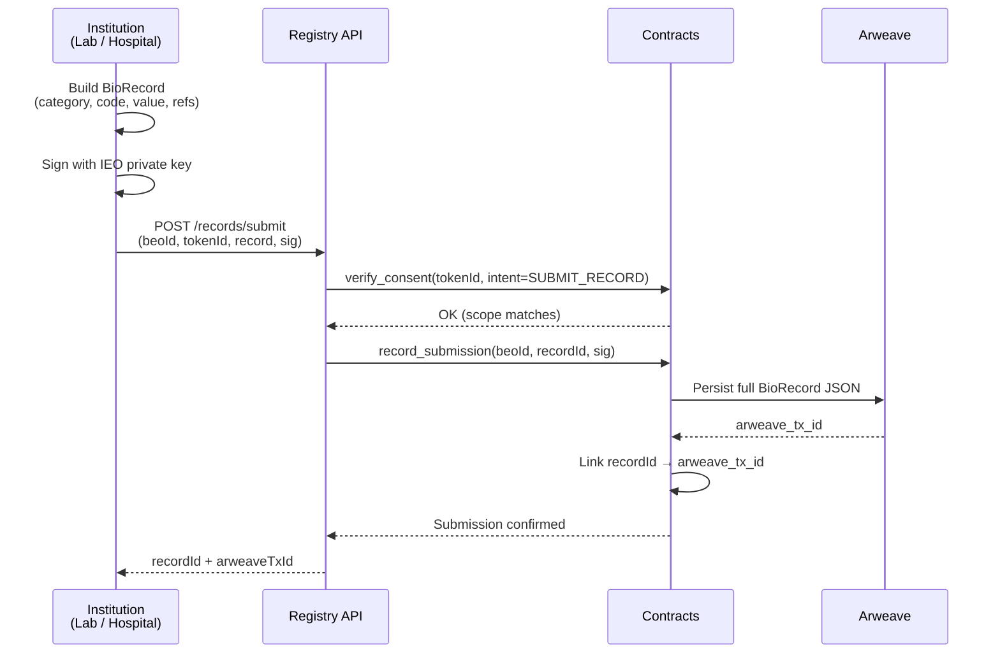
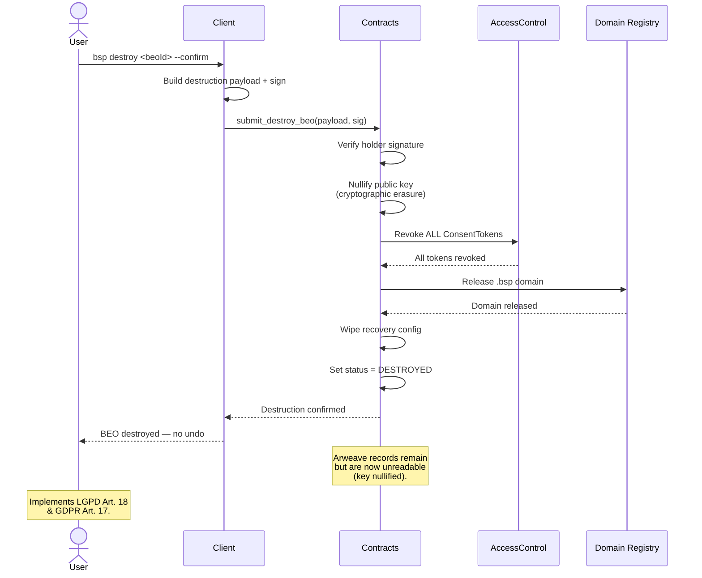

# BSP — Architecture

> How the Biological Sovereignty Protocol fits together, end to end.
> Version 0.2 — April 2026

---

## Overview

BSP is layered. The user holds the keys. The SDK and CLI sign operations locally. A gasless relayer submits transactions to Aptos Move contracts. Payloads are persisted on Arweave for permanence. No component in the chain can forge or modify a user's actions without the user's key.

---

## System Diagram

### Layers

| Layer | Component | Role |
|---|---|---|
| **Presentation** | `bsp-id-web`, `bspctl`, AI assistants | User-facing surfaces |
| **Client SDK** | `bsp-sdk-typescript`, `bsp-sdk-python` | Ed25519 signing, type definitions, payload builders |
| **Transport** | Registry API (relayer) | Gasless submission of signed payloads to chain |
| **Protocol** | Aptos Move contracts | Source of truth — BEO, IEO, ConsentToken, AccessControl |
| **Storage** | Arweave | Permanent BioRecord persistence |

---

## Trust Boundaries

| Boundary | Who trusts what |
|---|---|
| User ↔ Client (SDK/CLI/Web) | User trusts their machine and the signing code they run |
| Client ↔ Relayer | Client trusts nothing — payloads are signed. Relayer cannot forge. |
| Relayer ↔ Chain | Chain verifies every signature. Relayer is only a gas payer. |
| Chain ↔ Arweave | Chain pins the Arweave TX ID. Arweave guarantees permanence. |

The relayer is **infrastructure, not authority**. A compromised relayer cannot modify consent, forge records, or destroy a BEO. The worst a rogue relayer can do is refuse to relay — in which case any other relayer (or the user directly) can take over.

See `docs/RELAYER_SPEC.md` for the full relayer specification, minimum interface, and the permissionless multi-relayer model.

---

## Sequence: Create a BEO

---

## Sequence: Grant ConsentToken

---

## Sequence: Submit BioRecord (IEO → BEO)

---

## Sequence: Destroy BEO (Cryptographic Erasure)

---

## Component Responsibilities

### `bsp-sdk` (TypeScript / Python)
- Ed25519 keypair generation and signing
- Canonical payload serialization
- Type definitions for BEO, IEO, ConsentToken, BioRecord
- `ExchangeClient` — fetches records with on-chain consent verification

### `bspctl` (CLI)
- 22 commands covering full protocol lifecycle
- Local config at `~/.bsp/config.json`
- Delegates signing to `bsp-sdk`
- No server-side state

### `bsp-mcp` (MCP Server)
- stdio transport for AI assistants
- `ConsentGuard` gates every data-access tool
- Enforces intent + expiry + on-chain revocation state

### `bsp-id-web` (Frontend)
- React + Vite web app
- Generates keys in-browser (never sent to server)
- Issues ConsentTokens through a visual flow

### `bsp-registry-api` (Relayer)
- Receives signed payloads
- Submits Aptos transactions
- Pays gas on behalf of users
- Cannot modify or forge — signatures are verified on-chain

### Aptos Move Contracts
- `BEO` — sovereign biological identity
- `IEO` — institutional entity
- `AccessControl` — ConsentToken issuance, revocation, scope checks
- `DomainRegistry` — `.bsp` namespace

### Arweave
- Permanent storage for BioRecord JSON
- Chain stores only the Arweave TX ID pointer
- Economic incentive ensures 200+ year persistence

---

## Extensibility

New biomarkers, intents, and IEO types are added through the BIP (BSP Improvement Proposal) process. See `../bip/BIP-0000-template.md` and `spec/governance.md`.

---

## Related

- **Glossary** — `docs/GLOSSARY.md`
- **Error Codes** — `docs/ERROR_CODES.md`
- **Relayer Specification** — `docs/RELAYER_SPEC.md`
- **Threat Model** — `docs/THREAT_MODEL.md`
- **Implementation Guide** — `docs/implementation-guide.md`
- **Specification** — `spec/overview.md`
